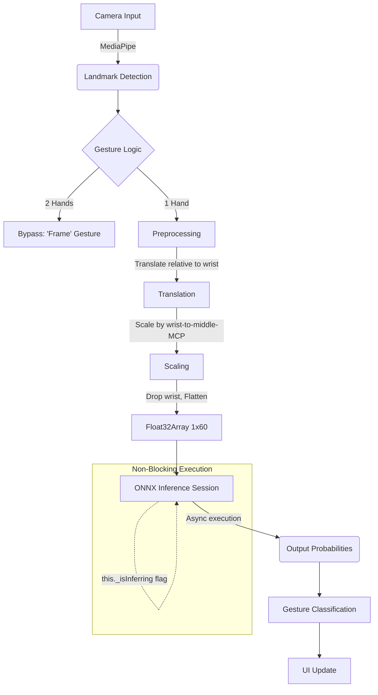

# ONNX Web Integration Plan

## Summary
This document provides a high-level overview of the plan to integrate the ONNX Web runtime into the gesture recognition application. The goal is to replace the current heuristic-based classification or placeholder ML classification with a robust, client-side inference pipeline using a pre-trained Multi-Layer Perceptron (MLP) model exported to the ONNX format.

## Objective
To enable real-time, in-browser gesture classification using an ONNX model, ensuring high performance without blocking the main rendering loop (`requestAnimationFrame`).

## User Journey
1. The user opens the web application.
2. The application loads the ONNX runtime (WASM execution provider) and the pre-trained `mlp_model.onnx`.
3. The user performs hand gestures in front of the camera.
4. The application captures landmarks, preprocesses them (translation, scaling, flattening), and feeds them into the ONNX model.
5. The model outputs classification probabilities asynchronously.
6. The application updates the UI with the predicted gesture and confidence score in real-time.

## System Architecture

## Phases
This implementation is broken down into minimal, testable phases:

*   **[Phase 1: Model Export & Setup](./phase-01-model-export.md)**: Ensure the trained MLP model is correctly exported to ONNX format and accessible by the web application.
*   **[Phase 2: ONNX Web Integration](./phase-02-onnx-web-integration.md)**: Integrate the ONNX runtime into the frontend, implement the mathematical preprocessing, and execute non-blocking inference.

## Acceptance Criteria
- [x] `mlp_model.onnx` is successfully loaded by `ort.InferenceSession` via WASM.
- [x] Landmark preprocessing correctly translates, scales, and flattens the 21 landmarks into a 1x60 `Float32Array`.
- [x] Inference runs asynchronously without blocking the `requestAnimationFrame` loop.
- [x] The two-hand "frame" gesture bypass remains functional.
- [x] The application accurately classifies single-hand gestures based on the ONNX model output.

## Resolved Questions
- ONNX I/O names verified: input is `'input'` shape `[batch, 60]`, output is `'output'` shape `[batch, 5]`. Confirmed in `export_onnx.py` lines 103-104.
- CORS: `.onnx` is served as a static file from the same origin (`./mlp_model.onnx`), no special CORS config needed.

## Code Review (2026-02-23)
All six review areas passed. See [review report](./reports/260223-reviewer-to-user-onnx-integration-review-report.md) for details. Medium-priority recommendations: pin CDN versions, add inference error recovery.